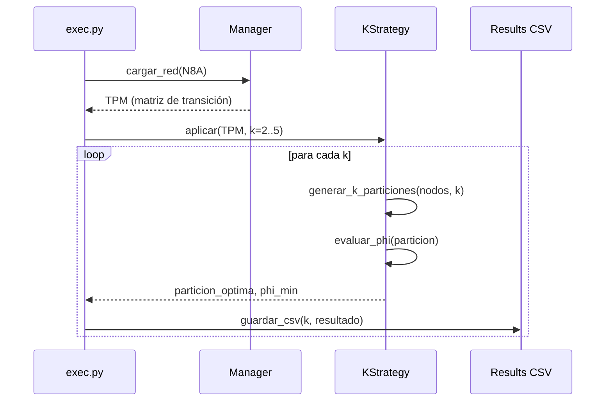

# Constitution

<!--
Reglas inmutables del proyecto: qué se puede y no hacer, criterios de software, calidad y principios del sistema.
-->

**Restricciones de red:**
- Trabajar con redes de tamaño 5, 8 y 10 únicamente. Solo el humano ejecuta pruebas con tamaños superiores.
- El tamaño canónico de prueba es **N=8** (`N8A.csv` y `DatosPruebas2026_1.xlsx`).

**Restricciones de código:**
- Cada archivo máximo **300 LOC**. Principio de responsabilidad única → alta modularidad, bajo acoplamiento.
- Nombrar las nuevas estrategias exactamente: **KQNodes** y **KGeoMIP** (sin variantes de capitalización).
- Los resultados se exportan siempre en **CSV**, un archivo por cada valor de k.

**Restricciones de k:**
- Se trabaja únicamente `k ∈ {2, 3, 4, 5}`.
- Para k=2, el resultado debe ser idéntico al de los algoritmos base (QNodes / GeoMIP).

---

# Clarification

<!--
Preguntas resueltas que deben estar claras de inicio a fin del desarrollo.
-->

| # | Pregunta | Respuesta |
|---|----------|-----------|
| 1 | ¿Qué es una k-partición? | División del conjunto de nodos del sistema en exactamente k subconjuntos disjuntos no vacíos. |
| 2 | ¿Qué métrica se minimiza? | Phi (φ) — pérdida de información integrada al particionar el sistema. |
| 3 | ¿El óptimo es siempre la MIP? | Sí: se busca la partición con **mínimo φ**, independiente de cómo quede dividido el sistema. |
| 4 | ¿Qué red de prueba se usa? | Red N=8 del archivo `DatosPruebas2026_1.xlsx`. |
| 5 | ¿Cómo se valida correctitud para k=2? | El resultado debe coincidir exactamente con la salida de QNodes y GeoMIP base (bipartición). |
| 6 | ¿Dónde viven las nuevas estrategias? | Módulos independientes: `/KQNodes/` y `/KGeoMIP/`, espejando la estructura de `/QNodes/` y `/GeoMIP/`. |
| 7 | ¿Formato de salida? | CSV por cada k, guardado en `/<modulo>/results/resultados_k<N>.csv`. |
| 8 | ¿Se requieren tests automáticos? | Sí: validación de k=2 contra base como test de regresión mínimo antes de continuar. |

---

# Specification

En el marco de la **IIT 4.0** (Integrated Information Theory), uno de sus principales enfoques es hallar la **MIP** (Minimum Information Partition) en sistemas con datos discretos y continuos.

## Algoritmos base (bipartición, k=2)

| Estrategia | Entrada | Salida | Complejidad |
|------------|---------|--------|-------------|
| [QNodes](/QNodes/exec.py) | TPM (matriz de transición) | Bipartición + φ mínimo | O(D³·N) — Queyranne lazy oracle |
| [GeoMIP](/GeoMIP/exec.py) | TPM | Bipartición + φ mínimo | O(2^(m+n)) fuerza bruta / geométrico |

## Objetivo del proyecto: extensión a k-particiones

Expandir ambas estrategias para producir **k-particiones** con `k ∈ {2, 3, 4, 5}`:

- **KQNodes** — extensión del algoritmo Queyranne para k grupos.
- **KGeoMIP** — extensión del enfoque geométrico-topológico para k grupos.

Para cada k se busca la partición que minimiza φ sobre la red N=8.

## Fuente de verdad para pruebas

- [DatosPruebas2026_1.xlsx](/data/DatosPruebas2026_1.xlsx) — dataset canónico, red N=8.
- Resultados generados por cada k y estrategia en formato CSV.
- Los óptimos de φ por cada k son comparados entre KQNodes y KGeoMIP.

## Documentación final

1. [Manual técnico](/manuals/tecnical/main.tex) · [Criterios](/context/tecnico.md)
2. [Manual de usuario](/manuals/user/main.tex) · [Criterios](/context/usuario.md)

[Criterios de calidad globales](/context/criterios.md)

---

# System Design

<!--
Arquitectura actual y objetivo del sistema. Diagramas Mermaid, decisiones de diseño, escalabilidad.
-->

## Arquitectura general

```
Proyecto V03 FINAL/
├── QNodes/          # Estrategia base — bipartición vía Queyranne
├──────KQNodes/         # [NUEVO] k-partición vía Queyranne extendido
├── GeoMIP/          # Estrategia base — bipartición geométrica
├──────KGeoMIP/         # [NUEVO] k-partición geométrica extendida
├── data/            # Datasets de prueba (DatosPruebas2026_1.xlsx)
├── manuals/         # Documentación LaTeX
└── context/         # Especificaciones del proyecto
```

Cada módulo replica la misma estructura interna:
```
<modulo>/
├── src/
│   ├── constants/       # Configuración y constantes
│   ├── controllers/     # Manager de redes
│   ├── funcs/           # Utilidades (EMD, biparticiones, formato)
│   ├── middlewares/     # Logging y profiling
│   ├── models/          # Application, SIA base, System, Solution, NCube
│   └── strategies/      # Estrategia principal y la version  con k-particiones
├── results/             # CSVs de salida
├── exec.py              # Punto de entrada
└── pyproject.toml
```

## Flujo de ejecución (secuencia)



---

# Fases del Desarrollo

## Fase 0 - Base funcional del sistema

> **Objetivo:** Compilar los algoritmos existentes antes de extenderlos.
> **Done cuando:** Ambas estrategias base corren correctamente sobre N8A sin errores.

- [x] Leer la arquitectura completa de `/QNodes/src/` (estrategia, modelos, funciones)
- [x] Leer la arquitectura completa de `/GeoMIP/src/` (estrategia, modelos, funciones)
- [x] Identificar las funciones que generan biparticiones en cada módulo
- [x] Identificar cómo se calcula φ (Earth Mover's Distance) en cada módulo
- [x] Corregir errores de ejecución de pruebas para el documento excel `/data/DatosPruebas2026_1.xlsx` y guardar los resultados en `results/` (actualmente se guardan en rutas incorrectas).
  - [x] Permitir hacer pruebas desde `/QNodes/exec.py` y generar CSV con resultados.
  - [x] Permitir hacer pruebas desde `/GeoMIP/exec.py` y generar CSV con resultados.
- [x] Ejecutar `QNodes` sobre `N8A.csv` y verificar salida correcta (φ=0.5 prueba 1 ✓)
- [ ] Ejecutar `GeoMIP` sobre `N8A.csv` y verificar salida correcta (pendiente ejecución completa)
- [x] Documentar diferencias estructurales entre QNodes y GeoMIP en [context/instructions.md](/context/instructions.md)

---

## Fase 1 — Implementación de KQNodes

> **Objetivo:** Extender QNodes para k-particiones funcionales con k ∈ {2,3,4,5}.
> **Done cuando:** KQNodes genera CSV con resultados para k=2,3,4,5 sobre N8 y k=2 coincide con QNodes base.

### 1.1 Estructura del módulo

- [ ] Crear fichero `QNodes/src/strategies/kqnodes.py`.
- [ ] Crear `QNodes/kexec.py` con punto de entrada para k configurable
- [ ] Validar que para k=2 produce las mismas biparticiones que el módulo base
- [ ] Verificar que el generador respeta 300 LOC máximo

### 1.3 Estrategia KQNodes

- [ ] Implementar `KQNodes/src/strategies/kqnodes.py` — adaptación del algoritmo Queyranne para k grupos
- [ ] El método principal recibe `(TPM, k)` y retorna `(particion_optima, phi_min)`
- [ ] Implementar evaluación de φ para cada k-partición candidata
- [ ] Verificar que el archivo no supera 300 LOC

### 1.4 Integración y validación

- [ ] Ejecutar KQNodes con k=2 sobre `N5A.csv` → resultado debe coincidir con QNodes base
- [ ] Ejecutar KQNodes con k=3 sobre `N5A.csv` → verificar que φ ≤ φ(k=2)
- [ ] Ejecutar KQNodes con k=2,3,4,5 sobre `N8A.csv`
- [ ] Guardar resultados en `KQNodes/results/resultados_N{i}A_k{k}.csv` para cada k

---

## Fase 2 — Implementación de KGeoMIP

> **Objetivo:** Extender GeoMIP para k-particiones funcionales con k ∈ {2,3,4,5}, dentro del módulo `/GeoMIP/` existente.
> **Done cuando:** KGeoMIP genera CSV con resultados para k=2,3,4,5 sobre N8 y k=2 coincide con GeoMIP base.

### 2.1 Estrategia KGeoMIP

- [ ] Crear fichero `GeoMIP/src/strategies/kgeomip.py` — extensión geométrica para k grupos
- [ ] El método principal recibe `(TPM, k)` y retorna `(particion_optima, phi_min)`
- [ ] Reutilizar las funciones de distancia EMD ya existentes en `GeoMIP/src/funcs/`
- [ ] Crear `GeoMIP/kexec.py` con punto de entrada para k configurable
- [ ] Verificar que ningún fichero nuevo supera 300 LOC

### 2.2 Integración y validación

- [ ] Ejecutar KGeoMIP con k=2 sobre `N5A.csv` → resultado debe coincidir con GeoMIP base
- [ ] Ejecutar KGeoMIP con k=3 sobre `N5A.csv` → verificar que φ ≤ φ(k=2)
- [ ] Ejecutar KGeoMIP con k=2,3,4,5 sobre `N8A.csv`
- [ ] Guardar resultados en `GeoMIP/results/resultados_N{i}A_k{k}.csv` para cada k

---

## Fase 3 — Experimentación y Validación

> **Objetivo:** Ejecutar ambas estrategias sobre el dataset canónico, comparar resultados y hallar óptimos.
> **Done cuando:** Existen 8 CSVs de resultados (4k × 2 estrategias) y la tabla + gráfica comparativa están generadas.

### 3.1 Ejecución sobre dataset canónico

- [ ] Cargar y procesar `DatosPruebas2026_1.xlsx` — red N=8
- [ ] Ejecutar `QNodes/kexec.py` para k=2,3,4,5 → guardar CSVs en `QNodes/results/`
- [ ] Ejecutar `GeoMIP/kexec.py` para k=2,3,4,5 → guardar CSVs en `GeoMIP/results/`

### 3.2 Verificación de correctitud

- [ ] Confirmar que KQNodes(k=2) == QNodes base (φ equivalente sobre N8)
- [ ] Confirmar que KGeoMIP(k=2) == GeoMIP base (φ equivalente sobre N8)
- [ ] Verificar que φ(k+1) ≤ φ(k) para ambas estrategias en N8 (monotonía esperada)

### 3.3 Análisis comparativo

- [ ] Generar tabla comparativa: `k | φ_KQNodes | φ_KGeoMIP | particion_optima_KQNodes | particion_optima_KGeoMIP`
- [ ] Generar gráfica φ vs k para ambas estrategias y guardarla en `data/resultados/`
- [ ] Documentar qué estrategia obtiene menor φ por cada k y justificar la diferencia

---

## Fase 4 — Documentación

> **Objetivo:** Completar manuales técnico y de usuario en LaTeX, compilables a PDF, cubriendo todos los criterios de evaluación.
> **Done cuando:** Ambos PDFs compilan sin errores y pasan la lista de [context/criterios.md](/context/criterios.md).

### 4.1 Manual Técnico ([manuals/tecnical/main.tex](/manuals/tecnical/main.tex))

- [ ] Resumen ejecutivo: problema, enfoque algorítmico, resultados principales, limitaciones
- [ ] Fundamentos teóricos: definición formal de k-partición, formulación de optimización, justificación de la extensión
- [ ] Arquitectura del software: diagrama general de módulos, diagrama de clases UML, decisiones de diseño
- [ ] Diseño algorítmico: pseudocódigo de KQNodes y KGeoMIP, estructuras de datos clave
- [ ] Análisis de complejidad: O(n,k) para cada estrategia, comparación con el caso base k=2
- [ ] Resultados experimentales: tablas de φ por k, gráficas, análisis de correctitud y monotonía
- [ ] Limitaciones y trabajo futuro
- [ ] Compilar `main.tex` → PDF sin errores ni warnings críticos

### 4.2 Manual de Usuario ([manuals/user/main.tex](/manuals/user/main.tex))

- [ ] Introducción: qué hace el software y para qué sirve
- [ ] Requisitos del sistema: OS, versión de Python, dependencias
- [ ] Instalación paso a paso con capturas de pantalla
- [ ] Guía de uso básico: formato de entrada, ejecución de `kexec.py`, interpretación del CSV de salida
- [ ] Parámetros disponibles: cómo configurar k, la red de entrada y el directorio de salida
- [ ] Solución de problemas comunes
- [ ] Tutorial completo con ejemplo sobre N8 (entrada → ejecución → resultados)
- [ ] Grabar video tutorial (8–15 min, instalación + ejemplo N8, audio + subtítulos en español)
- [ ] Incluir enlace al video en el manual
- [ ] Compilar `main.tex` → PDF sin errores ni warnings críticos

---

# Criterios de Validación (Definition of Done global)

| Criterio | Verificación |
|----------|-------------|
| KQNodes(k=2) ≡ QNodes base | φ idéntico sobre N8 del dataset canónico |
| KGeoMIP(k=2) ≡ GeoMIP base | φ idéntico sobre N8 del dataset canónico |
| Monotonía de φ | φ(k+1) ≤ φ(k) para ambas estrategias en N8 |
| Archivos CSV | 8 archivos: 4k × 2 estrategias, en `QNodes/results/` y `GeoMIP/results/` |
| LOC por archivo | Ningún fichero nuevo supera 300 líneas |
| Manuales compilables | `pdflatex main.tex` sin errores en ambos manuales |
| Cobertura de criterios | Todos los ítems de [context/criterios.md](/context/criterios.md) marcados |
